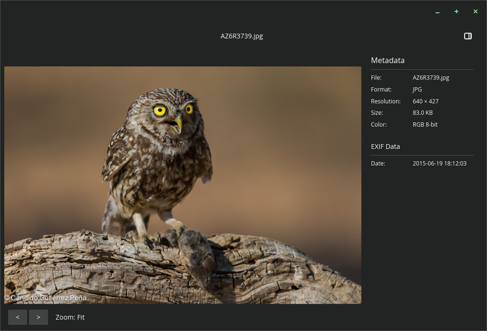

# Noctua

An image viewer application for the COSMIC™ desktop



## Keyboard Shortcuts

### Navigation

| Key   | Action            | Status  |
|:------|:------------------|:--------|
| `←`   | Previous document | working |
| `→`   | Next document     | working |

### Transformations

| Key         | Action                       | Status  |
|:------------|:-----------------------------|:--------|
| `H`         | Flip horizontal              | working |
| `V`         | Flip vertical                | working |
| `R`         | Rotate clockwise (90°)       | working |
| `Shift + R` | Rotate counter-clockwise (90°) | working |

### Zoom

| Key       | Action                     | Status  |
|:----------|:---------------------------|:--------|
| `+` / `=` | Zoom in                    | partial |
| `-`       | Zoom out                   | partial |
| `1`       | Reset zoom (100% / actual) | working |
| `F`       | Fit image to window        | working |

> **Note:** Zoom is recognized but visual feedback is limited without scrollable viewport.

### Pan

| Key        | Action                 | Status              |
|:-----------|:-----------------------|:--------------------|
| `Ctrl + ←` | Pan left               | not yet implemented |
| `Ctrl + →` | Pan right              | not yet implemented |
| `Ctrl + ↑` | Pan up                 | not yet implemented |
| `Ctrl + ↓` | Pan down               | not yet implemented |
| `0`        | Reset pan (center)     | not yet implemented |

> **Note:** Panning requires a scrollable viewport or custom canvas widget.

### Modes

| Key | Action            | Status              |
|:----|:------------------|:--------------------|
| `C` | Toggle crop mode  | not yet implemented |
| `S` | Toggle scale mode | not yet implemented |


## Installation

A [justfile](./justfile) is included by default for the [casey/just][just] command runner.

- `just` builds the application with the default `just build-release` recipe
- `just run` builds and runs the application
- `just install` installs the project into the system
- `just vendor` creates a vendored tarball
- `just build-vendored` compiles with vendored dependencies from that tarball
- `just check` runs clippy on the project to check for linter warnings
- `just check-json` can be used by IDEs that support LSP

## Translators

[Fluent][fluent] is used for localization of the software. Fluent's translation files are found in the [i18n directory](./i18n). New translations may copy the [English (en) localization](./i18n/en) of the project, rename `en` to the desired [ISO 639-1 language code][iso-codes], and then translations can be provided for each [message identifier][fluent-guide]. If no translation is necessary, the message may be omitted.

## Packaging

If packaging for a Linux distribution, vendor dependencies locally with the `vendor` rule, and build with the vendored sources using the `build-vendored` rule. When installing files, use the `rootdir` and `prefix` variables to change installation paths.

```sh
just vendor
just build-vendored
just rootdir=debian/noctua prefix=/usr install
```

It is recommended to build a source tarball with the vendored dependencies, which can typically be done by running `just vendor` on the host system before it enters the build environment.

## Developers

Developers should install [rustup][rustup] and configure their editor to use [rust-analyzer][rust-analyzer]. To improve compilation times, disable LTO in the release profile, install the [mold][mold] linker, and configure [sccache][sccache] for use with Rust. The [mold][mold] linker will only improve link times if LTO is disabled.

[fluent]: https://projectfluent.org/
[fluent-guide]: https://projectfluent.org/fluent/guide/hello.html
[iso-codes]: https://en.wikipedia.org/wiki/List_of_ISO_639-1_codes
[just]: https://github.com/casey/just
[rustup]: https://rustup.rs/
[rust-analyzer]: https://rust-analyzer.github.io/
[mold]: https://github.com/rui314/mold
[sccache]: https://github.com/mozilla/sccache
